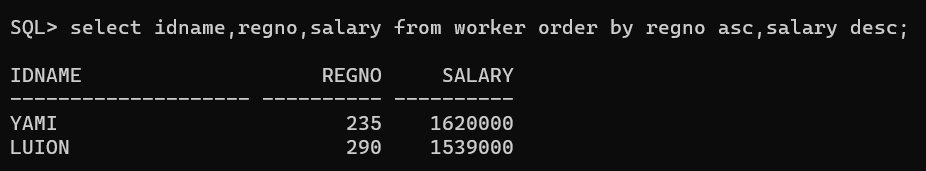
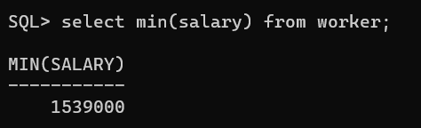
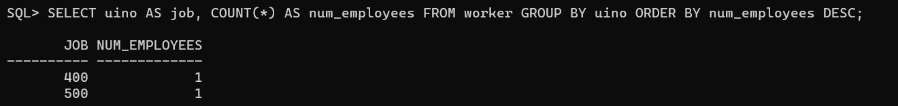

# EX-2-Data-Manipulation-Language-DML-and-Data-Control-Language-DCL-Commands

## DATE
## AlM:
To create a manager database and execute DML queries using SQL.

## DML(Data Manipulation Language)

The SQL commands that deal with the manipulation of data present in the database belong to DML or
Data Manipulation Language and this includes most of the SQL statements. It is the component of the
SQL statement that controls access to data and to the database. Basically, DCL statements are grouped
with DML statements.

## List of DML commands:

INSERT: It is used to insert data into a table.
UPDATE; It is used to update existing data within a table.
DELETE: It is used to delete records from a database table.

Create the table as given below:

create table worker(idnum number(30),idname char(20),regno number(20),salary number(20),uino number(10),cipt number(5),job char(20),age number(5));
## Insert the following values into the table

insert into worker values(1,'NAMON',234,200000,800,5678,'ASSISTANT',40);
insert into worker values(2,'YAMI',235,600000,500,5679,'MANAGER',50);
insert into worker values(3,'LUION',290,570000,400,5680,'SUPERVISRE',63);

## Q1) Update all the records of work table by increasing 10% of their salary as
bonus.

## QUERY:
update workER set salary=salary+(salary*1.70);
## OUTPUT:

## Q2) Delete the records from work table where the salary less than 2750.

## QUERY:

delete from worker where salary<500000;

## OUTPUT:

## Q3) Display each name of the employee as “Name” and annual salary as “Annual Salary” 

## QUERY:

select idname as "Name" salary*12 as "Annual salary" from worker;

## OUTPUT:

## Q4) List the names of Clerks from emp table.

## QUERY:

select idname from worker where job="MANAGER";
## OUTPUT:

## Q4)List the names of employee who are not Managers.

## QUERY:

select idname from worker where job <> 'MANAGER';
## OUTPUT:

## Q6) List the names of employees not eligible for commission.

## QUERY:

select idname from worker where regno=235;

## OUTPUT

## Q7) List employees whose name either start or end with ‘s’.

## QUERY:

 select idname from worker where idname like '%s' or idname like '%s';
 ## OUTPUT:

## Q8) Sort emp table in ascending order by hire-date and list ename, job, deptno,and hire-date.

## QUERY:

select idname,uino as "jobs",regno,cipt from worker order by cipt asc;
## OUTPUT:

## Q9) List the Details of Employees who have joined before regno.
## QUERY:

select * from worker where uino cipt <regno(235,290);
## OUTPUT

## Q10) List ename, deptno and sal after sorting emp table in ascending order bydeptno and then descending order by sal.

## QUERY:

select idname,regno,salary from worker order by regno asc,salary desc;

## OUTPUT:

## Q11) List the names of employees not belonging to dept no 30,40 & 10

## QUERY:

 select idname from worker where regno not in (234,235);

## OUTPUT:

## Q12) Find number of rows in the table EMP

## QUERY:

select count(*) from worker;
## OUTPUT:

## Q13) Find maximum, minimum and average salary in EMP table.
## QUERY:

select max(salary) from worker;

## OUTPUT:

select min(salary) from worker;

## OUTPUT:

## Q14) List the jobs and number of employees in each job. The result should be in the descending order of the number of employees.
## QUERY:

 SELECT uino AS job, COUNT(*) AS num_employees FROM worker GROUP BY uino ORDER BY num_employees DESC;

## OUTPUT:

## RESULT :

To create a manager database and execute DML queries using SQL is executed successfully.
