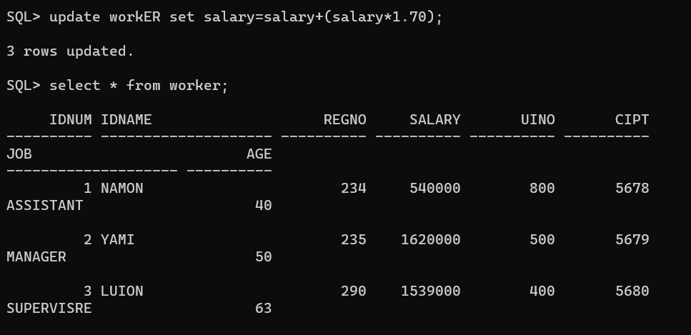

# EX-2-Data-Manipulation-Language-DML-and-Data-Control-Language-DCL-Commands
## AlM:

To create a manager database and execute DML queries using SQL.

## DML(Data Manipulation Language)

The SQL commands that deal with the manipulation of data present in the database belong to DML or
Data Manipulation Language and this includes most of the SQL statements. It is the component of the
SQL statement that controls access to data and to the database. Basically, DCL statements are grouped
with DML statements.

## List of DML commands:

INSERT: It is used to insert data into a table.
UPDATE; It is used to update existing data within a table.
DELETE: It is used to delete records from a database table.

Create the table as given below:#

create table manager(enumber number(6),ename char(15),salary number(5),commission number( A=»

## Insert the following values into the table

insert into work values(7369, 'Dharsan',2500,500,30000, '30-June-81', 'clerk',10, 'John');
insert into work values(1102, 'leonr',1100,400,41000, '23-december-12', 'manager',13, 'linyf');
insert into work values(3469, 'arvind',5500,100,45000, '56-febravary-29', 'assistant',86, 'chinaa');

## Q1) Update all the records of work table by increasing 10% of their salary as
bonus.

## QUERY:
update work set salary=salary+(salary*0.10);
## OUTPUT:

## Q2) Delete the records from work table where the salary less than 2750.

## QUERY:

delete from work where salary<2750;

## OUTPUT:

## Q3) Display each name of the employee as “Name” and annual salary as “Annual Salary” 

## QUERY:

select name as "Name" salary*12 as "Annual salary" from work;

## OUTPUT:

## Q4) List the names of Clerks from emp table.

## QUERY:

select ename from work where uioe="clerk’;

## OUTPUT:

## Q4)List the names of employee who are not Managers.

## QUERY:

select ename from manager where uioe <> 'work';
## OUTPUT:

## Q6) List the names of employees not eligible for commission.

## QUERY:

select ename from manager where len=500;

## OUTPUT

## Q7) List employees whose name either start or end with ‘s’.

## QUERY:

select name from work where ename like '%s' or ename like '%s';
## OUTPUT:

## Q8) Sort emp table in ascending order by hire-date and list ename, job, deptno,and hire-date.

## QUERY:

select name,uioe as "job",deptno,hierdate from work order by hierdate asc;

## OUTPUT:

## Q9) List the Details of Employees who have joined before 30 Sept 81.

## QUERY:

select * from work where uioe hierdate <to_date('1981-09-30','YYYY-MM-DD");

## OUTPUT

## Q10) List ename, deptno and sal after sorting emp table in ascending order bydeptno and then descending order by sal.

## QUERY:

select name,deptno,salary from work order by deptno asc,salary desc;

## OUTPUT:

## Q11) List the names of employees not belonging to dept no 30,40 & 10

## QUERY:

select ename from work where deptno not in (30,40,10);

## OUTPUT:

## Q12) Find number of rows in the table EMP

## QUERY:

select count(*) from work;

## OUTPUT:

## Q13) Find maximum, minimum and average salary in EMP table.
## QUERY:

select max(salary) from work;

## OUTPUT:

## Q14) List the jobs and number of employees in each job. The result should be in the descending order of the number of employees.
## QUERY:

SELECT designation AS job, COUNT(*) AS num_employees FROM manager GROUP BY designation
ORDER BY num_employees DESC;

## OUTPUT:

## RESULT :

To create a manager database and execute DML queries using SQL is executed successfully.
